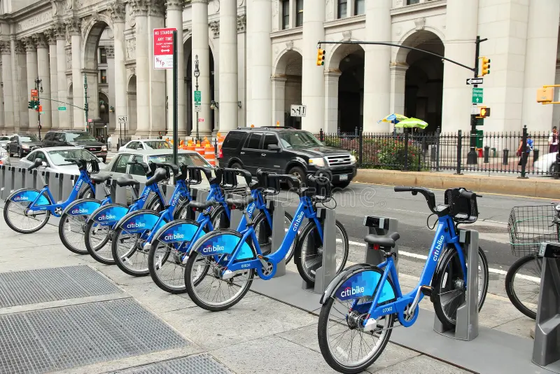
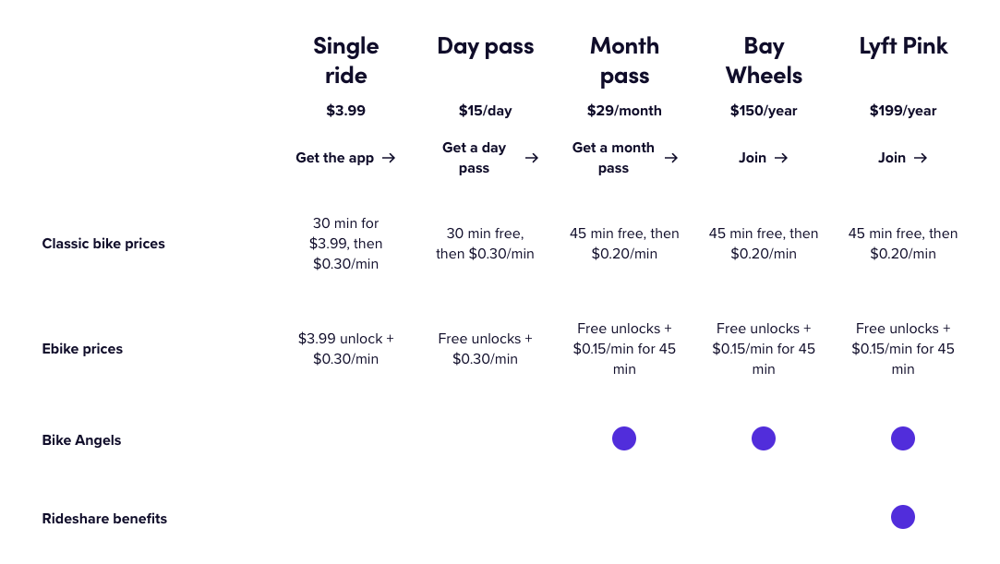
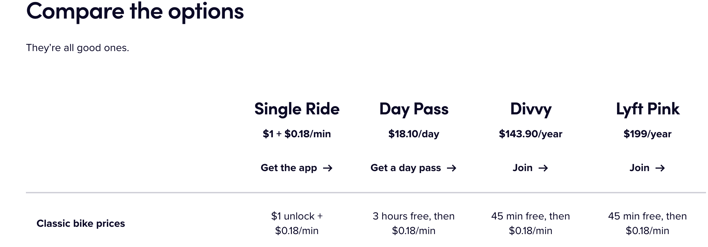
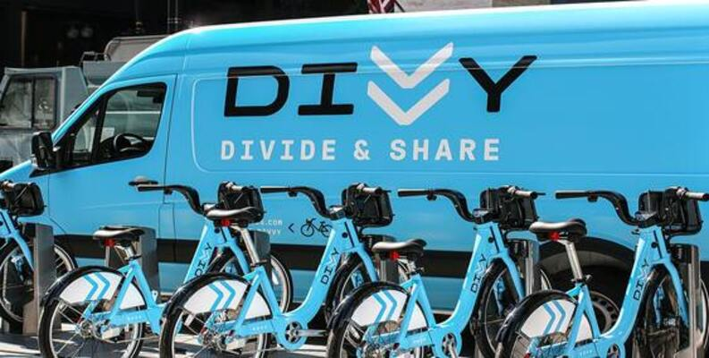
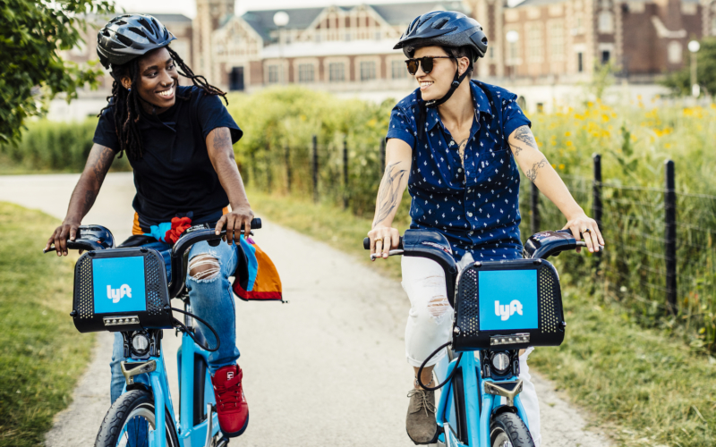

```{r, echo=FALSE, out.width="1500px", out.height="400px"}

```

a picture of a row of bike-share bikes

# Objectives:

-   

    ###### Import Cyclistic's Data

-   

    ###### Define their Business Questions

-   

    ###### Solve them through Analysis

## Overview

Have you ever seen all of those similar-looking branded bikes in the downtown area of a city? How about one of those docking stations (as shown above) with rows and rows of bikes connected, waiting for their next rider? If so, then you probably know what a bike-share company does. Companies like CitiBike, Lime, Lyft, and even Uber have all tried to deploy this service in different metropolitan areas like the San Francisco Bay Area, the Dallas-Fort Worth area, Chicago, Miami, and New York City. These services rely on GPS and Trackers, as well as connected docking stations to track the distance and ridership of each individual bike, often charging riders by distance and/or by flat-fee unlocks (when a bike is taken out of a docking station initially).

These services often rely on smartphone or cloud apps to process payments, calculate charges, and allow riders unlock bikes remotely after payment. Riders often have to pay every time they unlock a bike (**pay-per-ride payment structure**), or every minute/mile of use that the bike tracks (**pay-per-mile/pay-per-minute**). Some services, like Lyft Baywheels and Citi Bike also offer a monthly flat-fee membership which charges customers a lump amount every month for unlimited bike usages, discount, or even as a requirement for use. Subscribing customers can also recieve special perks like electric bike usage, discounted or complimentary companion bike use, and more.

```{r, echo=FALSE, out.width="1500px", out.height="500px"}

```

\small example of a subscription-based bike share service

## Introducing my Subject

```{r, echo=FALSE, out.width="250px", out.height="250px"}


```

| 

```{r, echo=FALSE, out.width="250px", out.height="250px"}


```

##### My Data Analysis project will be on the fictional bike share company Cyclistic, which is based on the real-life bike sharing company Divvy, based in Chicago.

### Analysis Tools

For this data analysis, I will be using:

1.  [Google Sheets (Spreadsheet Editor)](sheets.google.com)
2.  [Posit's RStudio Cloud and RStudio Desktop](https://posit.co/downloads/)
3.  R Markdown (To Produce this Summary)

## Target Questions

Based on the project specifications, this analysis will focus on providing a answer and evidence to support these questions:

-   

    #### How do annual members and casual riders use [Cyclistic/Divvy] bikes differently?

-   

    #### On average, would it be worth it for casual riders to upgrade to a annual subscription, and why?

## **Introducing the Data**

We will be using publicly available comma-separated value data sheets (DivvyQ12019.csv and DivvyQ12020.csv) available from [Divvy's data bank](https://divvybikes.com/system-data). These two spreadsheets contain Cyclistic’s ridership data from 2019 Quarter 1 and 2020 Quarter 1. Specifically, for the first file Divvy_Trips_2019_Q1 we are given the:

-   Unique **trip_id** of a bicycle trip (number)

-   **Start time and End time** of a trip (when a bicycle is taken out of a dock and put back in at the end), in “year-month-day 24-hour:minute:second” format, sorted in ascending order by start_time. (Datestamp)

-   Unique **id** of the bike that was used (Number)

-   Trip **duration** column between start time and end time, in seconds. (Number)

-   **Station which the bike was undocked at the beginning, and station which the bike was returned to at the end of the trip**, as well as **unique ids** of each station. (String)

-   **Status of the user of the bike** (Annual Subscriber or Casual rider) (String, either Subscriber or Customer)

-   Personal information of the user, including **gender** and **birth** **year**.

However, upon looking into Divvy_Trips_2020_Q1, we are given similar data, but the column names are inconsistent with the other file (we will have to change this during data cleaning).

-   Unique **ride_id** of a bicycle trip (number)

-   **Rideable_type** column (mostly docked_bike in this case, but can also include docked_scooter for E-scooter rentals) (String)

-   **Start time and End time** of a trip (when a bicycle is taken out of a dock and put back in at the end), in “year-month-day 24-hour:minute:second” format, sorted in ascending order by start_time. (Datestamp)

-   **Station** which the bike was undocked at the beginning, and station which the bike was returned to at the \* end of the trip, as well as unique ids of each station. (String)

-   **Latitude and Longitude** of the start and end stations, which will not really be relevant in our case.

-   **Member_casual**, which indicates if a rider is a subscribing customer or a casual rider.

This data is comprehensive, but contains a few errors we must correct before starting the analysis process. To do so, we will import the data into a spreadsheet software (I used Google Sheets) to get an idea of how the data is organized, the quantity of the data, and remove visible flaws which may skew the analysis.

## Cleaning with Google Sheets

To clean the provided excel/csv files of errors and other irregularities, We will use Google Sheets to process it before loading it into RStudio.

1.  **Remove all the blank cells from Birthdate and Gender, replacing them with N/A.**

2.  Made sure all of the datestamps (Ride Start Time and Ride End Time) are accurate and in the correct format to analyze.

3.  **Ensured that the Usertype column’s data was binary,** since it could only have two possible values: Subscriber, or Customer (non-subscribed/casual rider). If another value appears, than it is a mistake and should be replaced with N/A.

    {width="730"}

4.  **Converted the TripDuration column into a easier-to-read time** (from seconds to “hours:minutes:seconds” format) in order to ensure accuracy throughout the whole process.

5.  Used conditional formatting to **highlight the different status of the customers (blue/green for subscriber and orange for casual/non-subscribing customer).**

6.  **Added a day_of_week column according to project’s specifications,** which displays the day of the week in a easy-to-identify format (1 - Sunday, 7 - Saturday)

------------------------------------------------------------------------


In addition, I also tried to make Divvy_Trips_2020_Q1 consistent with Divvy_Trips_2019_Q1 by renaming some columns so they match the other spreadsheet:

1.  **Renamed member_casual to usertype,** and changed member to Subscriber, and casual to Customer.

2.  **Added a “tripDuration” column as well as a “ride_length” column** with the same format as in the Q1 2019 spreadsheet.

3.  **Added “day_of_week”** column with start_day represented as a day of the week (1 - Sunday, 7 - Saturday)

4.  Checked for any blanks, and **replaced them with N/A**. (Wasn't fully effective, so I will have to do again in R)

5.  Checked data for any improper values, and made sure all values matched their columns’ appropriate datatypes.

6.  **Sorted data by start_time, in ascending order,** to match the format of Q1 2019 spreadsheet.

## Deep Cleaning with R

### Setting up the Environment

Before we start on R, we want to set up the environment and install all necessary packages:

```{r}
#install.packages("tidyverse")
#install.packages("dplyr")
#install.packages("ggplot2")

# Load in the packages
library(tidyverse)
library(dplyr)
library(ggplot2)
```

Now that everything is installed, we can load our exported .csv files into the editor, and familiarize ourselves with the data.

```{r}
q1_2019 <- read_csv("Divvy Trips Q1_2019 (Cleaned).csv") #Assign variables
q1_2020 <- read_csv("Divvy Trips Q1_2020 (Cleaned).csv")

colnames(q1_2019) #Find the column names and display them
colnames(q1_2020)
```

From our column names output, we can see that the two csv files had similar data, but different column names. In order to work on them in R, we must change Q1 2019's column names to match up with the columns in Q1 2020's csv.

```{r}
## clean all of the data and make it consistent with q1_2020

(q1_2019 <- rename(q1_2019
                   ,ride_id = trip_id
                   ,rideable_type = bikeid
                   ,started_at = start_time
                   ,ended_at = end_time
                   ,start_station_name = from_station_name
                   ,start_station_id = from_station_id
                   ,end_station_name = to_station_name
                   ,end_station_id = to_station_id
                   ,member_casual = usertype
))

q1_2019 <- mutate(q1_2019, ride_id = as.character(ride_id)
                  ,rideable_type = as.character(rideable_type))
```

Now that everything matches up, we can combine our two data tables to make everything easier to analyze and work with. We also want to change some of the specific columns (like date, time, numbers) into their appropriate formats so that R can process them correctly in sorting and aggregation operations.

```{r}
all_trips <- bind_rows(q1_2019, q1_2020)#, q3_2019)#, q4_2019, q1_2020)

all_trips <- all_trips %>%
select(-c(start_lat, start_lng, end_lat, end_lng, birthyear, gender, "tripduration"))

all_trips <- all_trips %>%
  select(-c(day_of_week))


# Add columns that list the date, month, day, and year of each ride
# This will allow us to aggregate ride data for each month, day, or year ... before completing
# https://www.statmethods.net/input/dates.html more on date formats in R found at that link
all_trips$date <- as.Date(all_trips$started_at) #The default format is yyyy-mm-dd
all_trips$month <- format(as.Date(all_trips$date), "%m")
all_trips$day <- format(as.Date(all_trips$date), "%d")
all_trips$year <- format(as.Date(all_trips$date), "%Y")
all_trips$day_of_week <- format(as.Date(all_trips$date), "%A")

all_trips$ride_length <- difftime(all_trips$ended_at,all_trips$started_at)

all_trips$ride_length <- as.numeric(as.character(all_trips$ride_length))
```

Everything looks good so far. But, before we start analysis, lets make sure that everything looks in order.

```{r}
nrow(all_trips)
colnames(all_trips)
table(all_trips$member_casual)
summary(all_trips$ride_length)
```

Notice that the ride_length has a abnormally high maximum value of 10628422 seconds. That's about 123 days of riding a bike. This may have happened if someone forgot to return the bike for a long time, or may indicate a case of theft. However, in our data analysis, data points like these will mess up our calculations by inflating the mean and skewing the data towards the right. We can see this when we look at quartile 1, the median, and quartile 3; **Since the mean is more than double of the median, and more than quartile 3, we can see that these abnormal data points have skewed this measure**.

Also, look at the minimum value of -552 seconds. This is also another example of flawed data, since you can't ride a bike for negative five minutes. So, before continuing, lets eliminate these data points and other possibly flawed data points from our table.

```{r}
## Eliminate abnormally high ride_lengths over 86,400 seconds (amount of time in a day)
## Eliminate negative ride_lengths and invalid station names 
all_trips_v2 <- all_trips[!(all_trips$ride_length>86400 | all_trips$ride_length<0 | all_trips$start_station_name == "HQ QR"),]

# Should have done this earlier, but
# remove rows if member_casual is NA (data not available)
# This should be okay since we still have over 200,000 data points for analysis
all_trips_v2 <- all_trips_v2[!(is.na(all_trips_v2$member_casual)),]
# Count number of customer and subscriber rides for future reference
number_of_customer_rides <- all_trips_v2 %>% 
  filter(all_trips_v2$member_casual == "Customer") %>%
  nrow()
number_of_subscriber_rides <- all_trips_v2 %>% 
  filter(all_trips_v2$member_casual == "Subscriber") %>%
  nrow()

nrow(all_trips_v2)
summary(all_trips_v2$ride_length)
```

After removing our flawed data points, our table still has over 300,000 rows, meaning that it has more than enough data to come up with a accurate analysis and conclusion. Let's start analyzing in the next step!

## Data Analysis Time

First, let's compare the average ride time between non-members (customers) and subscribers by using the aggregate function for mean, min, max, median, and standard deviation (measure of variability of data points).

```{r}
# Get the Summary (Mean, Median, Maximum, Minimum and Standard Deviation) of our data
aggregate(all_trips_v2$ride_length ~ all_trips_v2$member_casual, FUN = mean)
aggregate(all_trips_v2$ride_length ~ all_trips_v2$member_casual, FUN = median)
aggregate(all_trips_v2$ride_length ~ all_trips_v2$member_casual, FUN = max)
aggregate(all_trips_v2$ride_length ~ all_trips_v2$member_casual, FUN = min)
aggregate(all_trips_v2$ride_length ~ all_trips_v2$member_casual, FUN = sd)
```

From this initial analysis, we can already tell a trend forming between a rider's membership status and their average ride length. Based on what we're seeing, it seems like **non-subscribers (casual customers) From this analysis, we can see that Customers, while having less rides, often ride their bikes longer than average compared to subscribers**. This may be in part because of planned usage, where customers will use Cyclistic's service if they really need to for longer trips, compared to subscribers, who use it more casually and liberally.

However, before finalizing this, we must dig a bit deeper and look at more of the data to make a informed decision. Next, let's analyze how the day of the week will affect the average ride time for both subscribing members and casual customers. We will use a more complex multi-part pipe function to do this.

```{r}
# analyze ridership data by type and weekday. Sort by day of week and customer group
day_of_week_vs_avg_duration <- all_trips_v2 %>%
mutate(weekday = wday(started_at, label = TRUE)) %>% 
group_by(member_casual, weekday) %>% 
summarise(average_duration = mean(ride_length)) %>% 
arrange(member_casual, weekday)

day_of_week_vs_avg_duration
```

From this, the trend repeats throughout all days of the week. So far, we are inferring that from a per-distance point of view, non-subscribing casual customers seem to have higher results independent of the day of week.

Now, let's look at how the number of rides vary between the two groups, according to day of the week. We will use the same function, except we will add number of rides in the summarise function, which displays it along with average duration.

```{r}
# analyze ridership data by type and weekday. Sort by day of week and customer group
day_of_week_vs_no_rides <- all_trips_v2 %>%
mutate(weekday = wday(started_at, label = TRUE)) %>% 
group_by(member_casual, weekday) %>% 
summarise(average_duration = mean(ride_length), number_of_rides = n()) %>%  # added number_of_rides
arrange(member_casual, weekday)

day_of_week_vs_no_rides
```

Now, let's display a summary of the max values from both of these tables

```{r}
day_of_week_vs_avg_duration %>%
  filter(average_duration == max(average_duration))

day_of_week_vs_no_rides %>%
  filter(number_of_rides == max(number_of_rides))
```

### Graphical Representation

We have the results of our analysis above. Here, we can see a different pattern start to emerge, but just to make sure, let's create graphical representations of these tables in the form of histograms.

```{r}
all_trips_v2 %>%
  mutate(weekday = wday(started_at, label = TRUE)) %>%
  group_by(member_casual, weekday) %>%
  
  summarise(number_of_rides = n()
            ,average_duration = mean(ride_length)) %>%
  arrange(member_casual, weekday) %>%
  ggplot(aes(x = weekday, y = number_of_rides, fill = member_casual)) +
  labs(title = "Number of Rides vs. Day of the Week",
       caption=paste0("Data from 2019 Q1 and 2020 Q1")) +
  geom_col(position = "dodge")
```

```{r}
all_trips_v2 %>%
  mutate(weekday = wday(started_at, label = TRUE)) %>%
  group_by(member_casual, weekday) %>%
  
  summarise(number_of_rides = n()
            ,average_duration = mean(ride_length)) %>%
  arrange(member_casual, weekday) %>%
  ggplot(aes(x = weekday, y = average_duration, fill = member_casual)) +
  labs(title = "Avg. Length of Ride vs. Day of the Week",
       caption=paste0("Data from 2019 Q1 and 2020 Q1")) +
  geom_col(position = "dodge")
```

Upon looking in the graphs (especially the combined one), we can see the trend identified above. Customers have higher average ride lengths (about \~2200 seconds or 36m, 40s) compared to subscribers (about \~700 seconds or 11m, 40s). This infers that customers are on average likely to ride their Cyclistic bike almost 3x the length as subscribers. Therefore, if the company wants to target less consistent, butlonger-duration riders, they should focus on attracting more non-subscribing customers. This will be beneficial if Cyclistic bills per minute/timewise compared to upfront flat-rate.

On the other hand, the number of rides chart show that Subscribers have a higher number of rides (almost 15 times more on peak days), while having lower average ride times. Looking at Divvy's pricing strategy, **this may be because of the perk "45 minutes free", which includes free unlocks and complementary 45 minute riding time before a charge of \$0.18 per minute**. So, taking this in account, these short rides by subscribers would come at no cost on average, fueling subscribers to take many more shorter distance rides, versus one longer ride, which may start incurring fees once the time passes 2,700 seconds (45 minutes).

### Taking a Deeper Dive on Revenue

```{r, echo=FALSE, out.width="1500px", out.height="300px"}

```

Now, given the prices above, let's determine whether it is more effective to try to attract customers to upgrade to annual subscribers. Since the data source does not provide any personal identifiable information (which allow us to distinguish the number of unique subscribers to calculate profits from subscription fees), we will try to compare the revenues of rides from subscribers and rides from customers.

First, let's find how much each ride from customers make on average:

```{r}
# $1 Unlock + $0.18 per minute
day_of_week_vs_no_rides %>% 
  filter(member_casual == "Customer") %>% # Limit dataset to only customer rides
  summarise(revenue = 1 + (0.18 * (average_duration / 60))) # Calculate average revenue per weekday
```

The chunk of code calculated that the average revenue Divvy makes from is around \$7.26 (\$6.74 to \$7.76). If we multiply this by the total number of rides, we can get a rough average on how much Divvy earned from customer rides during Q1 2019 and Q1 2020:

```{r}
number_of_customer_rides * 7.26  # Multiply average customer revenue by number of customer rides
```

**Around** \$**167,667.90** was made during these two quarters. If we were to generalize and extend these results for a year, **we find that \$335,339.40, or just under \$350,000 revenue was generated from Divvy customer rides**. Relatively low, but this figure makes sense because while each customer makes more money for the service per ride, there are much fewer rides taken by customers than subscribers.

Calculating the amount made from subscribers will be a bit more time-consuming, since a lot of them rely on complementary rides which are under 45 minutes, so, we will be working with all of the data rather than just the average values.

```{r}
# Function to calculate revenue for subscribers:
# If the time is under 45 minutes, free, otherwise, $0.18 per extra minute
subscriber_revenue <- function(duration){ 
  if(duration <= (45 * 60)){
    return(0)
  } else {
    return((0.18 * ((duration - (45 * 60)) / 60)))
  }
}

all_trips_v2 %>%
  filter(all_trips_v2$member_casual == "Subscriber") %>% # Limit to only subscribers
  mutate(revenue = sapply(ride_length, subscriber_revenue)) %>% # Calculate revenue for all rows
  summarize(total_revenue = sum(revenue)) # Add everything up
  
```

We will generalize and extend this data to cover a year by multiplying it by two to get \$79,055. This may seem pretty low (since most members take rides that are less than 45 minutes), but we must take into account the membership amount. While data on this is not publicly available from Divvy, a report from Chicago.gov states that Divvy annual membership during 2020 can be estimated as around 30,715 people; So, with this in account, we can estimate membership fees by multiplying membership cost of \$143.90 / year by the amount of annual members which gets us \$4,419,888.50. This all adds up to **\$4,498,943 total revenue generated by annual members.**

## Conclusion and Next Steps

```{r, echo=FALSE, out.width="600px", out.height="300px"}

```

\small A Divvy Truck next to a bike dock

Here's a recap about what we discovered during this data analysis project:

+--------------------------------------+---------------------------------+---------------------------------------------------------------------------------------------------------+
|                                      | Customer                        | Subscribers                                                                                             |
+======================================+=================================+=========================================================================================================+
| Number of Rides                      | Low (23,095 for two quarters)   | High (341,782 for two quarters)                                                                         |
+--------------------------------------+---------------------------------+---------------------------------------------------------------------------------------------------------+
| Average Ride Length                  | High (34.78 minutes)            | Moderate-Low (10.97 minutes)                                                                            |
+--------------------------------------+---------------------------------+---------------------------------------------------------------------------------------------------------+
| Revenue Generation from Rides        | Average: \$7.26 per ride        | Average: \$0.11 per ride                                                                                |
|                                      |                                 |                                                                                                         |
|                                      | Q1 2019 and 2020: **\$335,339** | Q1 2019 and 2020: **\$39,527**                                                                          |
|                                      |                                 |                                                                                                         |
|                                      | Estimated Yearly: **\$670,668** | Estimated Yearly: **\$79,054**                                                                          |
+--------------------------------------+---------------------------------+---------------------------------------------------------------------------------------------------------+
| Revenue Generation from Subscription | **N/A**                         | Average: \$143.90 per year Estimated (based on Chicago.gov data): **\$4,419,888.50** (\~30,715 members) |
|                                      |                                 |                                                                                                         |
|                                      | **\$0**                         |                                                                                                         |
+--------------------------------------+---------------------------------+---------------------------------------------------------------------------------------------------------+

### How do Subscribers and Customers Use Bikeshare Differently?

Our data has consistently shown that customers and subscribers use Divvy/Cyclistic's services very differently; **Customers use the service less often, but for longer amounts of time**, which generates high profit per customer; however, the trade off is that many customers only use the service a few times, and often only pay once or twice through the year.

So, to appeal to customers while improving profits, the bike share company should try to aim to upgrade them to paying subscribers; While subscribers often ride for free, reducing individual ride revenues and increasing wear from frequent bike use/docking, upgrading a customer allows the company to collect \$143 in subscription revenue annually (**which is almost worth 20 individual rides on average**).

**After paying a subscription fee, customers will receive the ability to ride for free, motivating them to use the service more for shorter distance trips;** As we have seen, our data supports this conclusion, considering that subscribers ride fifteen times more often than casual customers. **However, the ride length and the revenue generated from per-minute/per-ride billing decreases**, considering that despite a larger number of rides, subscribers collect about a tenth of the revenue that regular customers collect.

### Are Subscriptions Worth the Money for Customers?

```{r, echo=FALSE, out.width="700px", out.height="350px"}

```

It depends; If we look back on the data, we see that a annual subscription pass is worth around 20 individual 35-minute rides. So, if a customer is a more active user of the service, they would benefit from getting the annual subscription because it will save them money in the long run. If they use the service even more, they will get more out of the subscription because it also provides them with extra benefits similar to those provided with CitiBike's or Bay Wheel's subscription plans.

However, since many of the customers only ride once or twice, it would not be worth it for everyone to get the subscription. In that case, appealing towards all riders would not be a good use of resources; Cyclistic must appeal to the non-subscribing customers who rely on the bikes the most, because they will be the most receptive to marketing campaigns and in the end, will be more likely to convert from customer to subscriber.

### Works Cited

-   <https://www.sciencedirect.com/science/article/abs/pii/S1366554523001345>
-   <https://www.lyft.com/bikes/bay-wheels/pricing>
-   <https://www.chicago.gov/city/en/depts/cdot/provdrs/bike/news/2023/april/divvy-for-the-entire-city--divvy-service-hits-all-50-wards.html>
-   <https://divvybikes.com/pricing>
-   <https://rstudio.github.io/cheatsheets/html/rmarkdown.html>
